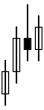

<p align="center">
  
</p>


<h1 align="center">Trading Platform</h1>

<p align="center">
  A simple platform for conducting financial market experiments and simulations.
</p>

<p align="center">
  <a href="https://github.com/dthinkr/trading_platform/stargazers"></a>
  <a href="https://github.com/dthinkr/trading_platform/network/members"></a>
  <a href="https://github.com/dthinkr/trading_platform/pulls"></a>
  <a href="https://github.com/dthinkr/trading_platform/issues"></a>
  <a href="https://github.com/dthinkr/trading_platform/graphs/contributors"></a>
  <a href="https://github.com/dthinkr/trading_platform/blob/master/LICENSE"></a>
</p>
  
<p align="center">
  <a href="#key-features">Key Features</a> •
  <a href="#installation">Installation</a> •
  <a href="#usage">Usage</a> •
  <a href="#project-structure">Project Structure</a> •
  <a href="#contributing">Contributing</a> •
  <a href="#license">License</a>
</p>

<p align="center">
    
  </p>
</div>

## Key Features

- 🚀 Real-time trading simulation
- 🌐 WebSocket-based communication
- 🖥️ Vue.js frontend with Vuetify
- ⚡ FastAPI backend
- 🔧 Customizable trading scenarios
- 📊 Advanced data analysis tools

## Installation

### One-liner Self-Host

```bash
bash <(curl -sSL https://raw.githubusercontent.com/dthinkr/trading_platform/main/trading_platform_run.sh)
```

### Manual Setup

#### Frontend

```bash
cd front
npm install
```

#### Backend

```bash
cd back
pip install -r requirements.txt
```

## Usage

### Development Server

#### Frontend

```bash
cd front
npm run dev
```

Access at `http://localhost:3000`

#### Backend

```bash
cd back
uvicorn client_connector.main:app --reload
```

API available at `http://localhost:8000`

### Production Build

```bash
cd front
npm run build
```

## Project Structure

```
trading_platform/
├── front/                 # Vue.js frontend
│   ├── src/
│   │   ├── assets/
│   │   ├── components/
│   │   ├── layouts/
│   │   ├── pages/
│   │   ├── plugins/
│   │   ├── store/
│   │   └── styles/
│   ├── public/
│   └── package.json
├── back/                  # FastAPI backend
│   ├── client_connector/
│   ├── main_platform/
│   ├── traders/
│   ├── structures/
│   └── analysis/
└── README.md
```

## Recent Updates

### July 10, 2024

- 🌐 Public access link
- 🏗️ Integrated front and backend structure
- 🚀 One-liner self-host command
- 📊 Expanded evaluation framework (20+ metrics)

### July 4, 2024

- 🔄 Enhanced Noise Trader behavior
- 📚 Implemented Order Book State function
- 💹 Configurable default price
- 🧠 Improved Informed Trader logic

[View full changelog](CHANGELOG.md)

## Contributing

We welcome contributions! Here's how you can help:

1. Fork the project
2. Create your feature branch (`git checkout -b feature/AmazingFeature`)
3. Commit your changes (`git commit -m 'Add some AmazingFeature'`)
4. Push to the branch (`git push origin feature/AmazingFeature`)
5. Open a Pull Request

## License

This project is licensed under the MIT License. See the [LICENSE](LICENSE) file for details.

## Acknowledgements

- [Vue.js](https://vuejs.org/)
- [Vuetify](https://vuetifyjs.com/)
- [FastAPI](https://fastapi.tiangolo.com/)
- [Highcharts](https://www.highcharts.com/)

---

<p align="center">
  Made with ❤️ by the Team
</p>
