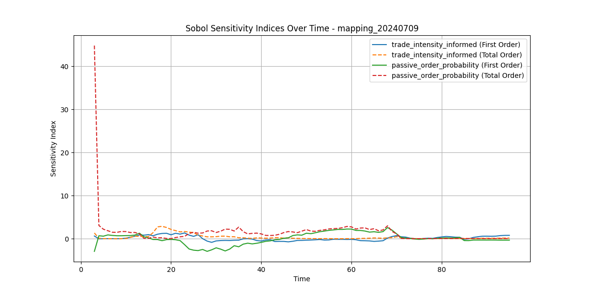

# Trading Platform


A trading platform for conducting financial market experiments and simulations.

## 🚀 Features

- Real-time trading simulation
- WebSocket-based communication
- Vue.js frontend with Vuetify
- FastAPI backend
- Customizable trading scenarios
- Data analysis tools


## 📋 Table of Contents

- [Installation](#installation)
- [Usage](#usage)
- [Project Structure](#project-structure)
- [Contributing](#contributing)
- [License](#license)

## Main Changes

### July 10 2024

1. public link to the trading platform for all to access
2. newly integrated front and backends with a cleaner structure
3. a one-liner command to self-host the platform
   - bash <(curl -sSL https://raw.githubusercontent.com/dthinkr/trading_platform/main/trading_platform_run.sh)
4. an expanded evaluation framework that enables tracking 20+ time-series performance metrics and perform time-series sensitivity analysis
   - https://github.com/dthinkr/trading_platform/tree/main/back/analysis
   - for example, the following figure evaluates the individual contributions of two parameters to the variability in one performance metric (orderbook imbalance) across trading time
   - 
### July 4 2024

1. Noise Trader Behavior:

   - Enhanced to override existing orders when sending a new one
2. Order Book State:

   - Implemented controlled function $M: \text{Parameters} \rightarrow \text{Order Book State}$
   - [Book initializer](https://github.com/dthinkr/trader_london/blob/e84347657ed0f6794a7484a7164dd34e27c0042e/traders/book_initializer.py) now sets the initial order book state
3. Default Price:

   - Removed hard-coded default price (2000)
   - Price is now a configurable parameter throughout the system
4. Informed Trader Behavior:

   - Orders now based on best bid plus an edge parameter: $\text{Order Price} = \text{Best Bid} + \text{Informed Edge}$
   - Order execution logic: - If $\text{Best Bid} + \text{Informed Edge} \geq \text{Top Ask}$, send order

5. Additional Notes:
    - Some recent changes to the informed trader were reverted due to conflicts
    - Database connection requires further optimization for deployment
    - #2 the Book initializer is necessary because it handles the order book intialization.
    - #4 Informed does not always send order. Potentially, this could lead to it not finishing its task, but such likelihood is rare, whcih can be studied.

6. Extra Changes:
   - Timer and agents now do not act until the order book is initialized.
   - The timer in the frontend is no longer a mock and can sync with the backend.


## 🛠 Installation

### Frontend

```bash
cd front
npm install
```

### Backend

```bash
cd back
pip install -r requirements.txt
```

## 🖥 Usage

### Starting the Development Server

#### Frontend

```bash
cd front
npm run dev
```

The frontend will be accessible at `http://localhost:3000`.

#### Backend

```bash
cd back
uvicorn client_connector.main:app --reload
```

The backend API will be available at `http://localhost:8000`.

### Building for Production

```bash
cd front
npm run build
```

## 🗂 Project Structure

```
trading_platform/
├── front/                 # Vue.js frontend
│   ├── src/
│   │   ├── assets/
│   │   ├── components/
│   │   ├── layouts/
│   │   ├── pages/
│   │   ├── plugins/
│   │   ├── store/
│   │   └── styles/
│   ├── public/
│   └── package.json
├── back/                  # FastAPI backend
│   ├── client_connector/
│   ├── main_platform/
│   ├── traders/
│   ├── structures/
│   └── analysis/
└── README.md
```

## 🤝 Contributing

Contributions are welcome! Please feel free to submit a Pull Request.

1. Fork the project
2. Create your feature branch (`git checkout -b feature/AmazingFeature`)
3. Commit your changes (`git commit -m 'Add some AmazingFeature'`)
4. Push to the branch (`git push origin feature/AmazingFeature`)
5. Open a Pull Request

## 📄 License

This project is licensed under the MIT License. See the [LICENSE](LICENSE) file for details.

## 🙏 Acknowledgements

- [Vue.js](https://vuejs.org/)
- [Vuetify](https://vuetifyjs.com/)
- [FastAPI](https://fastapi.tiangolo.com/)
- [Highcharts](https://www.highcharts.com/)
