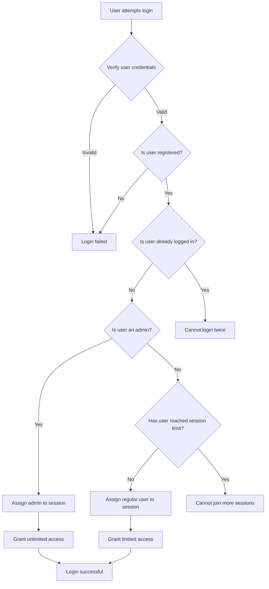

<p align="center">
  
</p>

<h1 align="center">Trading Platform</h1>

<p align="center">
  A simple platform for conducting financial market experiments and simulations.
</p>

<p align="center">
  <a href="https://github.com/dthinkr/trading_platform/stargazers"></a>
  <a href="https://github.com/dthinkr/trading_platform/network/members"></a>
  <a href="https://github.com/dthinkr/trading_platform/pulls"></a>
  <a href="https://github.com/dthinkr/trading_platform/issues"></a>
  <a href="https://github.com/dthinkr/trading_platform/graphs/contributors"></a>
  <a href="https://github.com/dthinkr/trading_platform/blob/master/LICENSE"></a>
</p>

<p align="center">
  <a href="#key-features">Key Features</a> •
  <a href="#installation">Installation</a> •
  <a href="#usage">Usage</a> •
  <a href="#project-structure">Project Structure</a> •
  <a href="#contributing">Contributing</a> •
  <a href="#license">License</a>
</p>

<p align="center">
    
  </p>
</div>

## Key Features

- 🚀 Real-time trading simulation
- 🌐 WebSocket-based communication
- 🖥️ Vue.js front with Vuetify
- ⚡ FastAPI back
- 🔧 Customizable trading scenarios
- 📊 Advanced data analysis tools

## User Authentication and Session Management



## Installation

### One-liner Self-Host

```bash
bash <(curl -sSL https://raw.githubusercontent.com/dthinkr/trading_platform/main/trading_platform_run.sh)
```

### Manual Setup

#### front

```bash
cd front
npm install
```

#### back

```bash
cd back
pip install -r requirements.txt
```

## Usage

### Development Server

#### front

```bash
cd front
npm run dev
```

Access at `http://localhost:3000`

#### back

```bash
cd back
uvicorn api.endpoints:app --reload
```

API available at `http://localhost:8000`

### Production Build

```bash
cd front
npm run build
```

## Project Structure

```
trading_platform/
├── front/                 # Vue.js front
│   ├── src/
│   │   ├── assets/
│   │   ├── components/
│   │   ├── layouts/
│   │   ├── pages/
│   │   ├── plugins/
│   │   ├── store/
│   │   └── styles/
│   ├── public/
│   └── package.json
├── back/                  # FastAPI back
│   ├── api/
│   ├── core/
│   ├── traders/
│   ├── data_models/
│   └── analysis/
└── README.md
```


## Recent Updates

Key highlights from version 1.3.0:

- 🔄 Implemented multi-trader, multi-session trading functionality
- 🔐 Added user authentication system
- 📊 Enabled download of session metrics from log files
- 🎯 Introduced manual goal setting for each human trader
- 🧠 Added options to set trader as Informed or Speculator
- 🖥️ Enhanced trading dashboard with improved order display
- 💹 Implemented Market Earnings calculation and display
- 🔢 Improved share counting for goal tracking
- 🗃️ Shifted from database to log-based data storage
- 🧹 Removed potentially confusing metrics for clearer user experience

For a full list of changes, please refer to our [Changelog](CHANGELOG.md).

## License

This project is licensed under the MIT License. See the [LICENSE](LICENSE) file for details.

## Acknowledgements

- [Vue.js](https://vuejs.org/)
- [Vuetify](https://vuetifyjs.com/)
- [FastAPI](https://fastapi.tiangolo.com/)
- [Highcharts](https://www.highcharts.com/)

---